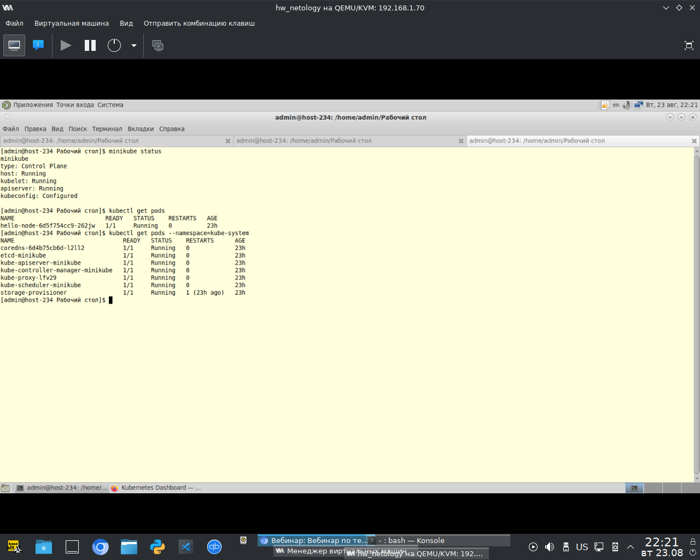
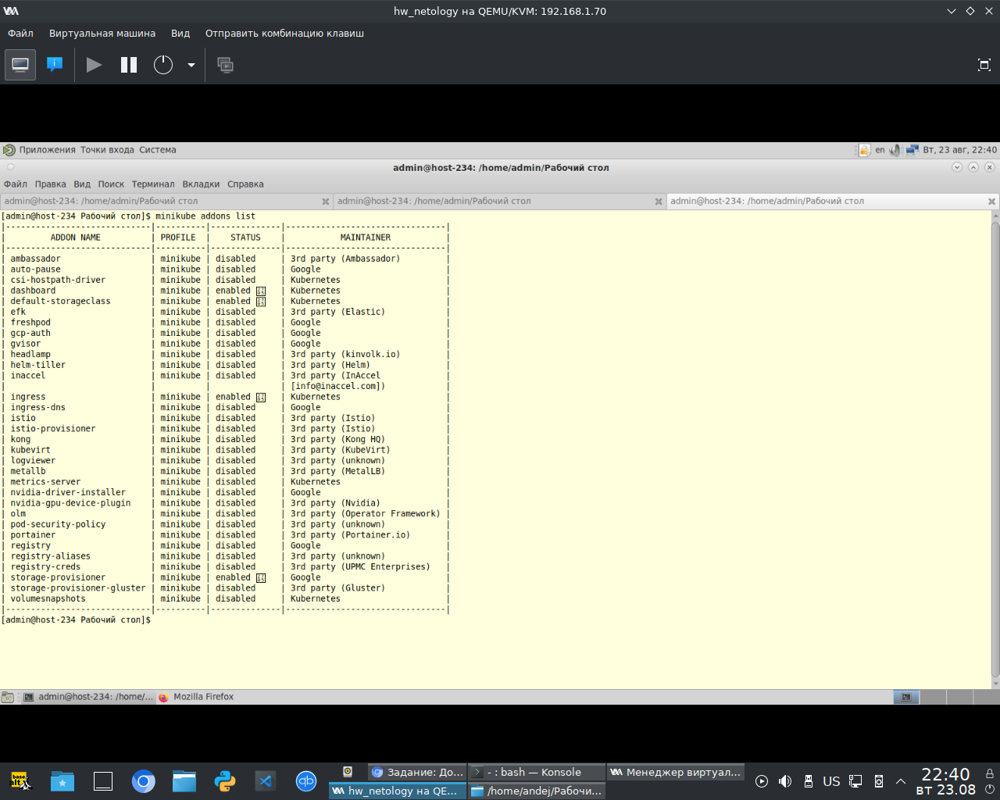
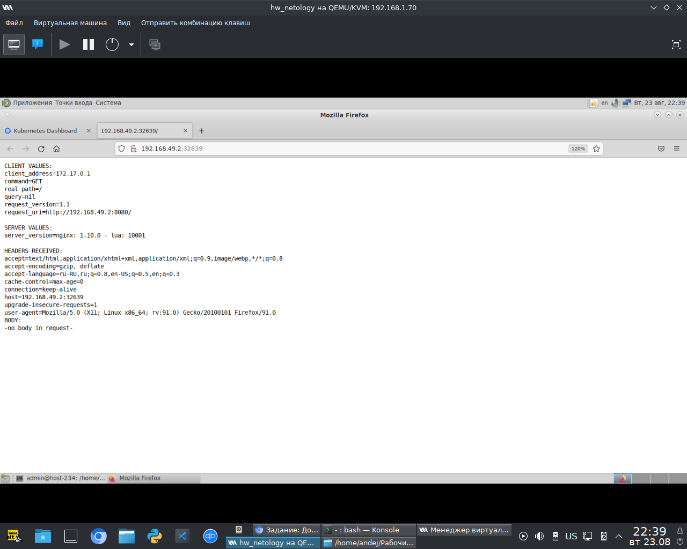
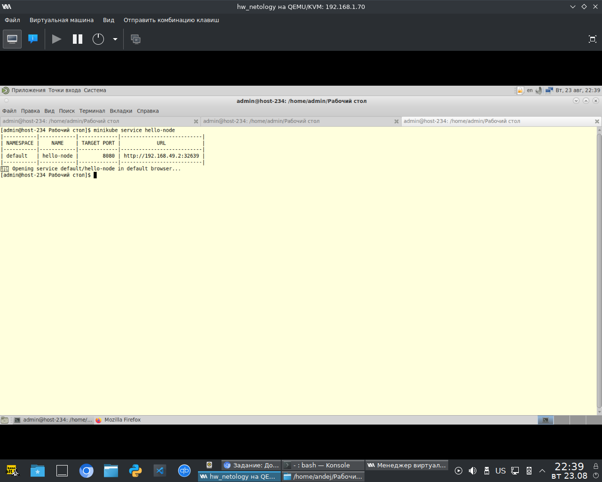
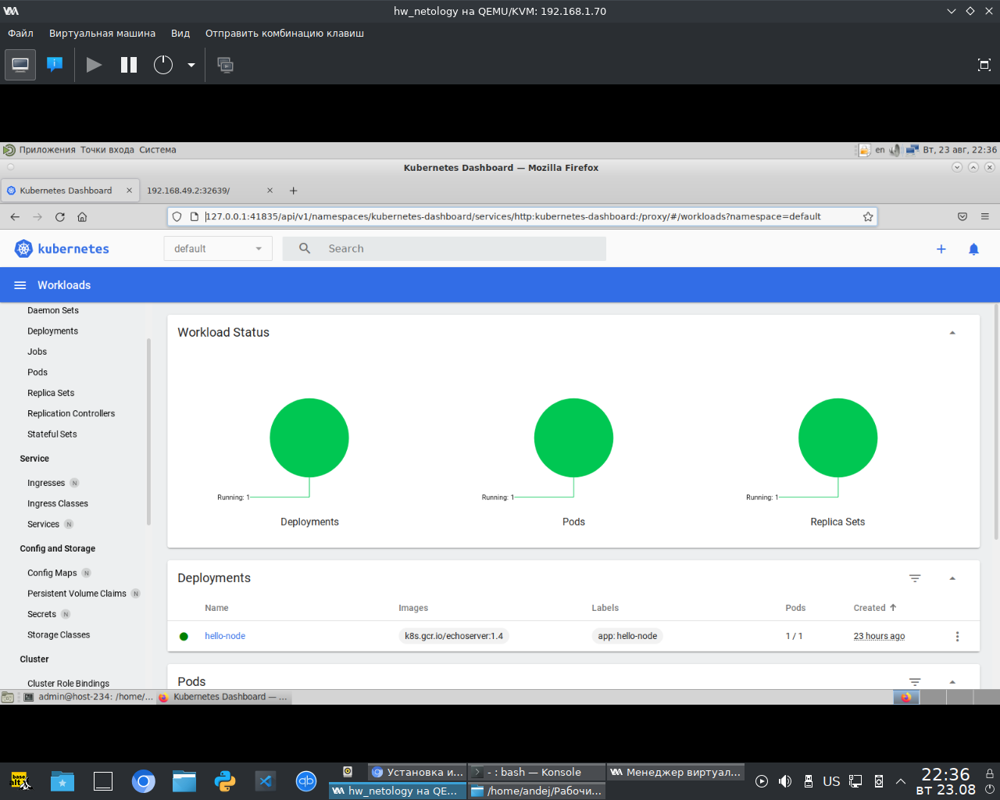
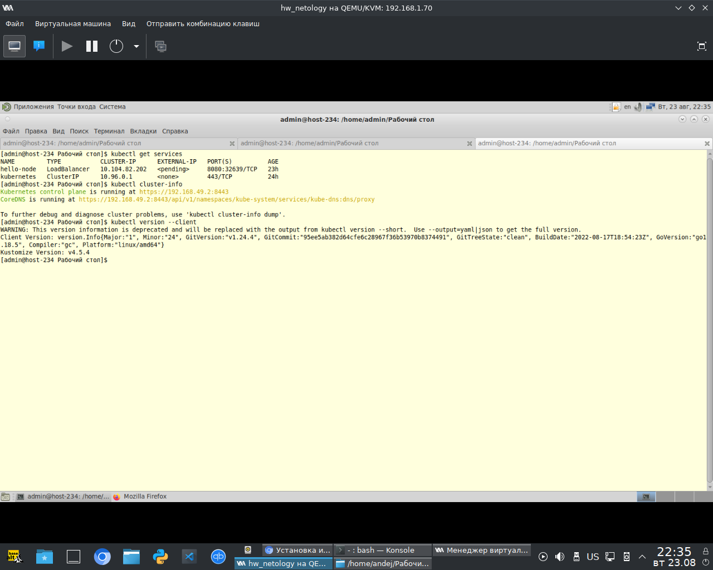

# Домашнее задание к занятию "12.1 Компоненты Kubernetes"

### Задача 1: Установить Minikube

Ответ:

Вывод команды `minikube status`


---

### Задача 2: Запуск Hello World
```
развернуть через Minikube тестовое приложение
по туториалу
установить аддоны ingress и dashboard
```

Ответ:

Установлены аддоны:


Приложение работает:



Доступ в dashboard


### Задача 3: Установить kubectl

Ответ:
Установлен kubectl
